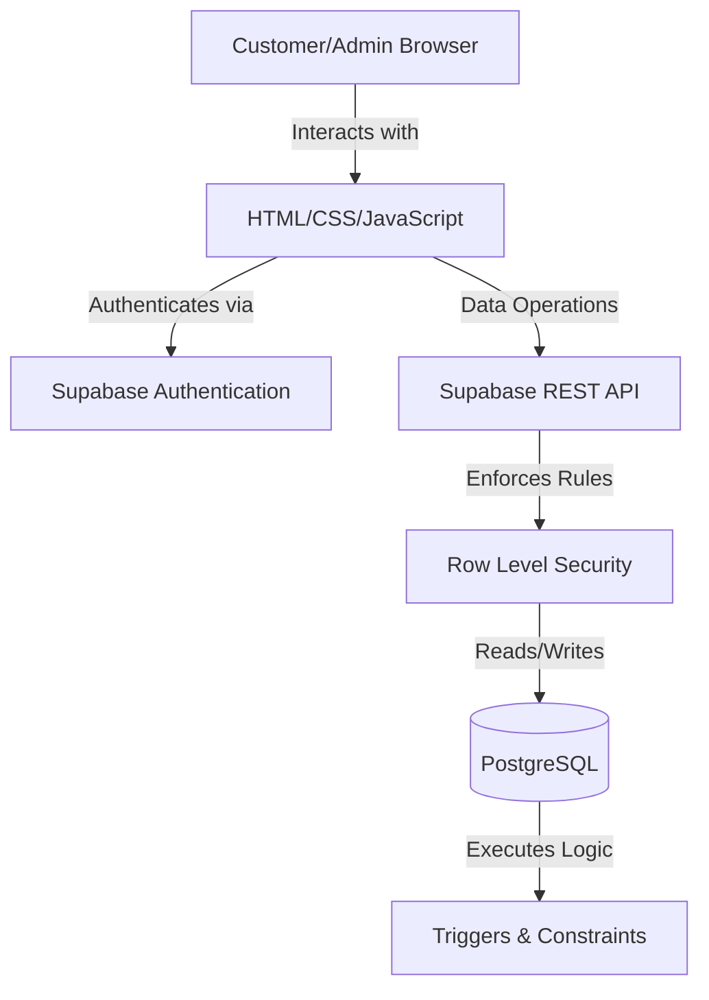
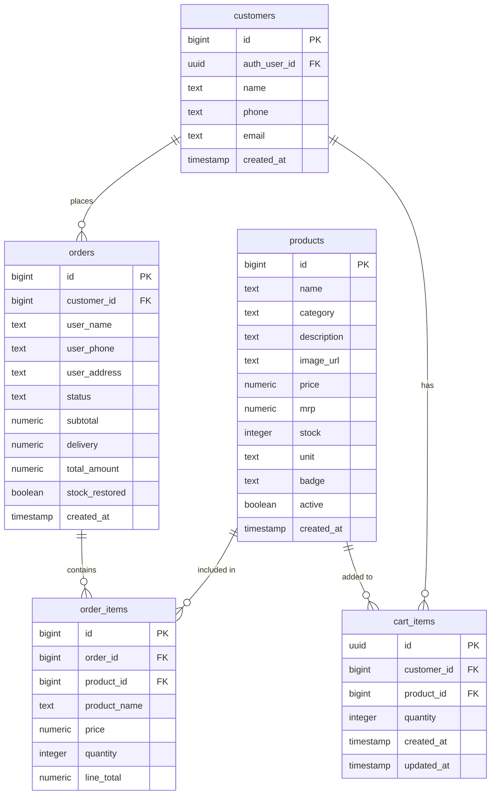

# Saravana Agency Crackers Shop

## Project Overview
Saravana Agency Crackers Shop is a web-based e-commerce application designed to facilitate the online sale of firecrackers. The system provides a modern, responsive interface for customers to browse the product catalog, manage a shopping cart, and securely place orders. It also features a dedicated admin dashboard for inventory management, order processing, and customer oversight.

## Features
- **Public Product Catalog**: Browse available firecrackers without needing an account.
- **Persistent Shopping Cart**: Guests can manage a cart locally; authenticated users' carts are synchronized with the database.
- **Secure Authentication**: Customer and Admin login/registration via Supabase Auth.
- **Checkout Processing**: Calculates subtotals, delivery fees, and grand totals, seamlessly converting the cart into an order.
- **Inventory Management**: Real-time stock deduction upon order placement.
- **Admin Dashboard**: Secure routing for administrators to manage products, view customers, and update order statuses (including handling cancellations and stock restoration).

## System Architecture

## Technology Stack
- **Frontend**: HTML5, CSS3, Vanilla JavaScript (ES6+).
- **Authentication**: Supabase Auth (Email/Password).
- **Database**: Supabase PostgreSQL.
- **Data Access**: Supabase REST API (via `supabase-js` client library).
- **Backend Logic**: PostgreSQL Triggers and Constraints.
- **Version Control**: Git / GitHub.

## Folder Structure
- `index.html`: Main landing page, product catalog, and checkout flow.
- `login.html`: Customer and Admin authentication.
- `customer-dashboard.html`: Customer portal to view order history.
- `admin-dashboard.html`: Admin portal to manage products, inventory, and orders.
- `style.css`: Core design system and responsive styling.
- `data.js`: Centralized business logic, state management (CartDB, AuthDB, ProductsDB), and XSS utilities.
- `supabase-client.js`: Initialization of Supabase client and wrapper API methods.
- `docs/`: Technical documentation (testing, error boundaries, reviews).
- `tests/`: Automated unit tests.

## Authentication
- **Customer Authentication**: Handled via Supabase `signUp` and `signIn`. Upon registration, a corresponding profile is created in the `customers` table.
- **Admin Authentication**: A hardcoded administrator email (`askr5499@gmail.com`) acts as the superuser.
- **Frontend UI Routing**: Javascript verifies the current session and redirects unauthorized users away from protected dashboards.
- **Database-Level Authorization**: Frontend UI checks are purely for user experience. The true security boundary is **Supabase RLS**, which ensures that even if a user manipulates the frontend, they cannot access or modify restricted database records.

## Database Schema

## RLS Policies
The application relies heavily on PostgreSQL Row Level Security to protect data.

- **`products`**: 
  - `SELECT`: Enabled for all users (public browsing).
  - `ALL`: Admin only (`auth.email() = 'askr5499@gmail.com'`).
- **`customers`**: 
  - `INSERT`: Users where `auth.uid() = auth_user_id`.
  - `SELECT` / `UPDATE`: Users reading their own record, or Admin.
- **`orders`**: 
  - `INSERT`: Users where `customer_id` maps to their `auth.uid()`.
  - `SELECT`: Order owner, or Admin.
  - `UPDATE` / `DELETE`: Admin only.
- **`order_items`**: 
  - `INSERT`: Users who own the parent `order_id`.
  - `SELECT`: Order owner, or Admin.
  - `UPDATE` / `DELETE`: Admin only.
- **`cart_items`**: 
  - `ALL`: Users who own the `customer_id`, or Admin.

## Database Triggers and Constraints

- **`stock_nonnegative`**: A `CHECK (stock >= 0)` constraint on the `products` table ensures inventory can never drop below zero.
- **`tr_set_order_item_price`**: Executes `set_order_item_price()` on `INSERT` to `order_items`. It overrides any client-supplied price with the canonical `products.price` from the database.
- **`tr_reduce_stock`**: Executes `reduce_product_stock()` on `INSERT`/`UPDATE`/`DELETE` to `order_items` to physically deduct purchased quantities from `products.stock`.
- **`tr_update_order_total`**: Executes `update_order_total()` on `INSERT`/`UPDATE`/`DELETE` to `order_items` to recalculate the parent order's subtotal directly in the database.
- **`tr_reset_order_totals`**: Executes `reset_order_totals_on_insert()` on `INSERT` to `orders`.
- **`tr_order_cancel_stock`**: Executes `restore_stock_on_cancel()` on `UPDATE` to `orders`. If an order's status changes to 'Cancelled', it restores the stock exactly once, marking `stock_restored = true` to prevent double restoration.

## Checkout Flow
1. **Cart**: User adds items to the cart (managed in localStorage or the database if authenticated).
2. **Login**: User must authenticate to proceed.
3. **Cart Review**: User reviews selected products.
4. **Delivery Information**: User inputs address and contact details.
5. **Final Review**: Delivery fees (₹60, or FREE if subtotal >= ₹1000) are applied.
6. **Order**: Frontend issues an API call to insert the `orders` record.
7. **Order Items**: Frontend issues API calls to insert `order_items`.
8. **Stock Update**: Database triggers automatically deduct stock and validate totals.
9. **Confirmation**: Cart is cleared, and the user is redirected to the dashboard.

*Note: Guests can maintain a local cart, but authentication is strictly required to finalize checkout.*

## Inventory Lifecycle
- **Cart**: Adding items to the cart does **not** deduct stock.
- **Order Item Insertion**: Creating an `order_items` row natively deducts stock via trigger.
- **Cancellation**: Canceling an order triggers a stock restoration exactly once.
- **Repeated Cancellation**: Handled safely. The `stock_restored` boolean prevents duplicate restoration on subsequent updates.

## Security
- **RLS**: Enabled on all tables.
- **Price Tampering Protection**: Fully protected by PostgreSQL triggers. Client prices are ignored.
- **Total Tampering Protection**: Fully protected by PostgreSQL triggers.
- **Stock Protection**: Enforced by atomic triggers and `CHECK` constraints.
- **XSS Mitigations**: All user-generated text is processed through `escapeHtml()` or `escapeJs()` before insertion into `.innerHTML` or inline handlers.
- **Secrets**: No `service-role` keys or hardcoded passwords exist in the frontend code.

*No remaining security issues were identified within the tested Review 2 scope.*

## API / Supabase Operations
The project uses the `supabase-js` client (e.g., `.from('table').select()`) rather than custom REST endpoints.

- **Authentication**: `supabase.auth.signUp`, `supabase.auth.signInWithPassword`, `supabase.auth.signOut`.
- **Products**: `.from('products').select('*')` to fetch catalog. Admin uses `.insert()`, `.update()`, `.delete()`.
- **Cart**: `.from('cart_items').upsert()` for authenticated users.
- **Orders**: 
  - The client first executes `.from('orders').insert({...})` to create the parent order.
  - The client then iterates through cart items and executes `.from('order_items').insert([...])`.
- **Error Behavior**: API responses are structured as `{ ok: boolean, data/error }`. The UI interprets this and presents human-readable alerts.

## Error Handling
Detailed error boundaries are documented in `docs/error-handling.md`. The codebase actively catches:
- Authentication failures (e.g., invalid credentials).
- Network disconnects (via `.catch()` chains).
- Database constraint violations (e.g., negative stock throws a PostgreSQL exception which is safely caught and prevented).

## Testing
We utilize a multi-layered testing strategy documented in `docs/testing.md` and `docs/test-results.md`.
- **Unit Checks**: An automated Node.js script (`tests/unit_tests.js`) validates business logic, cart arithmetic, and XSS utility functions.
- **Database Verification**: Live Read-Only SQL verification confirms RLS and trigger enforcement.
- **Manual Integration**: Verification of login flows, cart persistence, and order placement.

## Known Limitations
- **Non-Atomic Order Flow**: The checkout process currently involves two sequential HTTP API requests (one for `orders`, followed by `order_items`). While the database is secure against tampering, a network failure between the two requests could technically result in an empty order record. A future enhancement should migrate this logic into a unified PostgreSQL RPC to achieve true atomicity.
- **Inline Handlers**: While XSS vectors have been neutralized with `escapeJs`, the project still utilizes inline `onclick` attributes. A future refactor could transition these to discrete `addEventListener` bindings.
